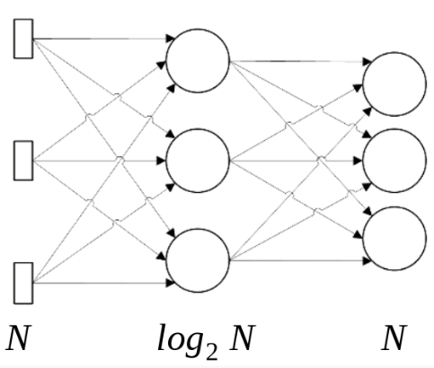

# Exercicio 2

Implemente uma rede MLP para os seguintes casos:

1. Experimente a rede implementada no problema do XOR.

2. Considere o problema de auto-associador (encoding problem) no qual um conjunto de padrões ortogonais de entrada são mapeados num conjunto de padrões de saída ortogonais através de uma camada oculta com um número pequeno de neurônios. A figura em anexo mostra a arquitetura básica para se resolver este problema.

 - Essencialmente, o problema é aprender uma codificação de padrão com p-bit em um padrão de log2 p-bit, e em seguida aprender a decodificar esta representação num padrão de saída.

 - Pede-se: Construir o mapeamento gerado por uma rede multi-camadas com o algoritmo backpropagation (BP), para o caso do mapeamento identidade, considerando dois casos: 

 a) Padrão de entrada e Padrão de Saída: Id(8x8) e Id(8X8) 

 b) Padrão de entrada e Padrão de Saída: Id(15x15) e Id(15X15) 

 - Onde Id denota a matriz identidade. 

